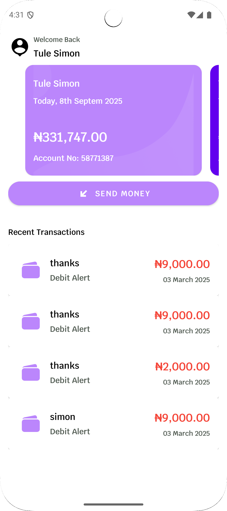
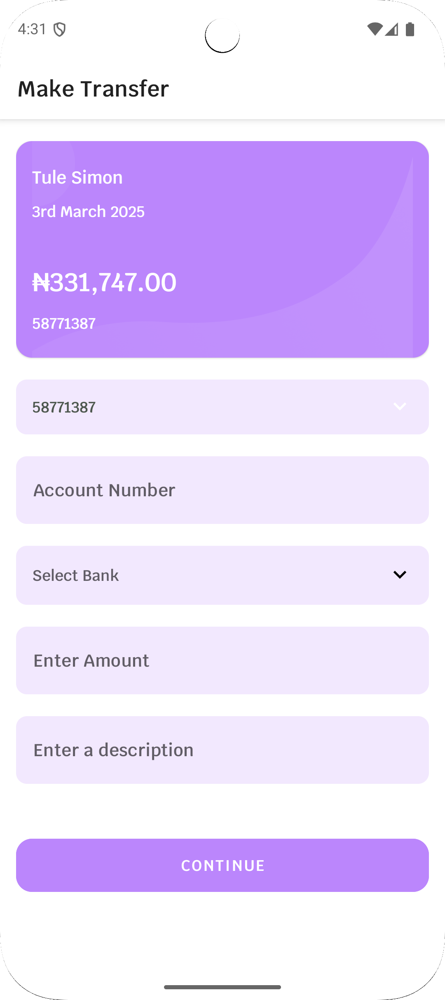
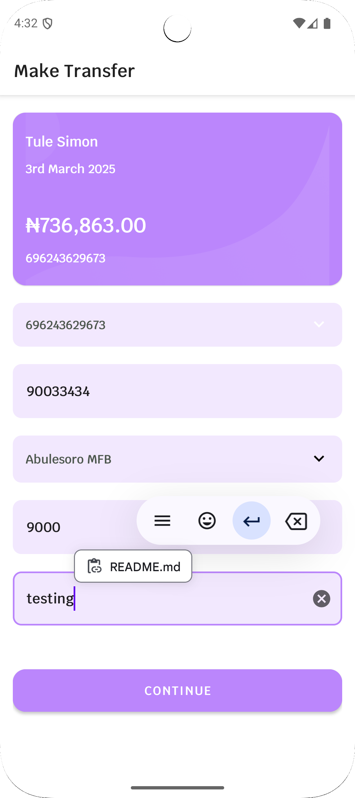
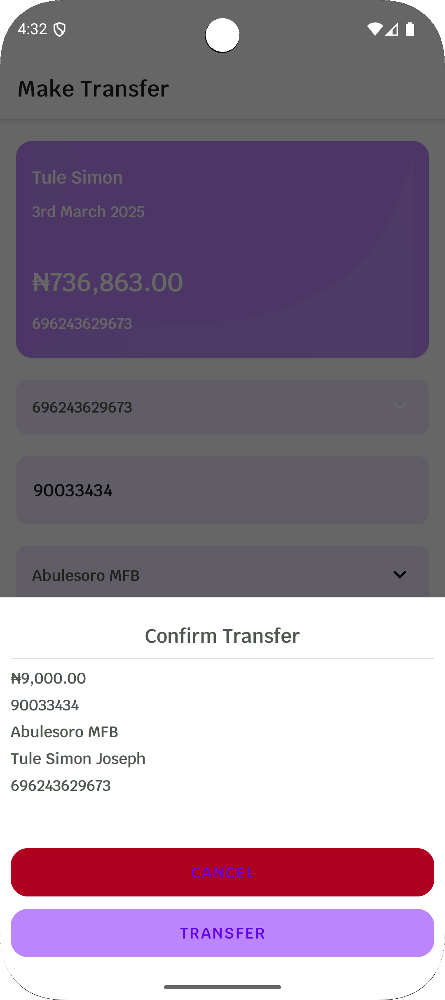
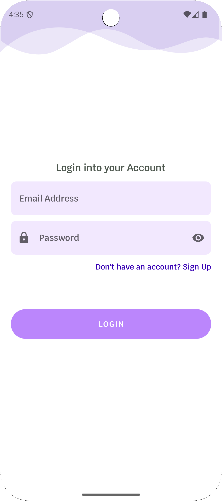
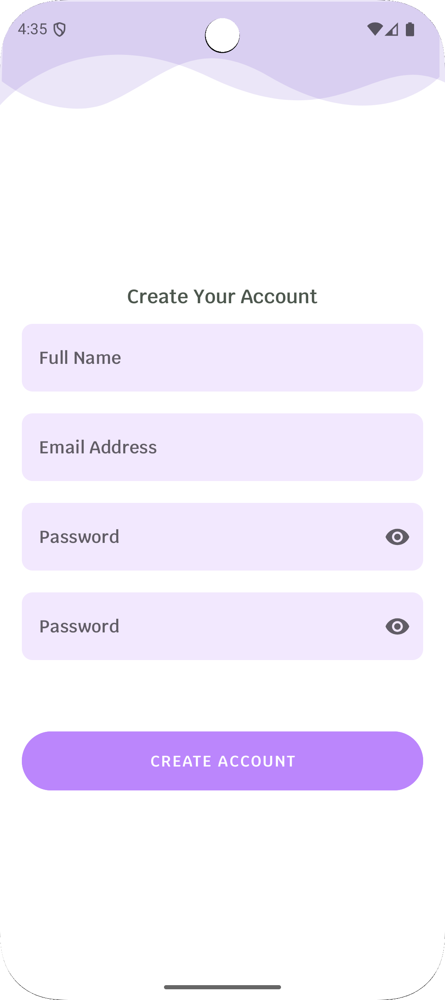

# Money Transfer & Payment App

Welcome to the **Money Transfer & Payment App**, a modern Android application designed to facilitate seamless money transfers and payments. This app leverages cutting-edge technologies like **Firebase Authentication**, **Hilt for Dependency Injection**, and **Room Database** for local storage. Below is an overview of the app's architecture, features, and setup instructions.

---
## Screenshots

| Home Screen                   | Transfer Money                | Send Money                     |
|-------------------------------|-------------------------------|--------------------------------|
|  |  |  |


## Screenshots2

| Confirm Screen                  | LoginScreen                     | Signup Screen              |
|---------------------------------|---------------------------------|----------------------------------|
|  |  |  |

## Features

- **User Authentication**: Secure user authentication using **Firebase Authentication**.
- **Money Transfers**: Send money to other users with ease.
- **Transaction History**: View all past transactions stored locally using **Room Database**.
- **Clean Architecture**: Follows the **MVVM (Model-View-ViewModel)** pattern for a clean and maintainable codebase.
- **Dependency Injection**: Uses **Hilt** to manage dependencies efficiently.
- **Real-Time Updates**: Firebase integration ensures real-time updates for authentication and other services.

---

## Tech Stack

- **Authentication**: Firebase Authentication
- **Local Database**: Room Database
- **Dependency Injection**: Hilt
- **Architecture**: MVVM (Model-View-ViewModel)
- **UI**: Jetpack Compose or XML (whichever is used)
- **Networking**: Retrofit (if applicable)
- **Other Libraries**: LiveData, Coroutines, ViewModel, etc.

---

## Architecture Overview

The app follows a clean and modular architecture, ensuring separation of concerns and scalability. Here's a breakdown of the architecture:

### 1. **UI Layer**
- **Views**: Activities, Fragments, or Jetpack Compose components.
- **ViewModels**: Acts as a bridge between the UI and the data layer. Exposes data to the UI and handles user interactions.

### 2. **Domain Layer**
- **Repository**: Centralizes data access logic. Communicates with the data sources (local and remote) and provides a clean API to the ViewModel.

### 3. **Data Layer**
- **Local Data Source**: Uses **Room Database** to store transaction history (`TransactionEntity`) and other local data.
- **Remote Data Source**: Integrates with **Firebase** for authentication and other remote services.

### 4. **Dependency Injection**
- **Hilt**: Manages dependencies across the app, ensuring a clean and testable codebase.

---

## Key Components

### 1. **TransactionEntity**
- Represents a transaction in the app.
- Stored in the **Room Database**.
- Fields:
  ```kotlin
  @Entity(tableName = "transactions")
  data class TransactionEntity(
      @PrimaryKey val transactionId: String = UUID.randomUUID().toString(),
      val amount: Long,
      val description: String,
      val sourceAccountNumber: Long,
      val destinationAccount: Long,
      val destinationBankId: String,
      val destinationUserName: String,
      val timeStampLong: Long
  )
  ```

### 2. **ViewModel**
- Communicates with the **Repository** to fetch or update data.
- Exposes data to the UI using **LiveData** or **StateFlow**.

### 3. **Repository**
- Acts as a single source of truth for data.
- Combines data from local (Room) and remote (Firebase) sources.

### 4. **Room Database**
- Stores all user transactions locally.
- Provides offline access to transaction history.

### 5. **Firebase Authentication**
- Handles user sign-up, login, and authentication.
- Ensures secure access to the app.

---

## Setup Instructions

### Prerequisites
- Android Studio (latest version recommended).
- Firebase project setup (for authentication).
- Basic knowledge of Kotlin, Room, Hilt, and Firebase.

### Steps to Run the App

1. **Clone the Repository**
   ```bash
   git clone https://github.com/TuleSimon/vpdassesment.git